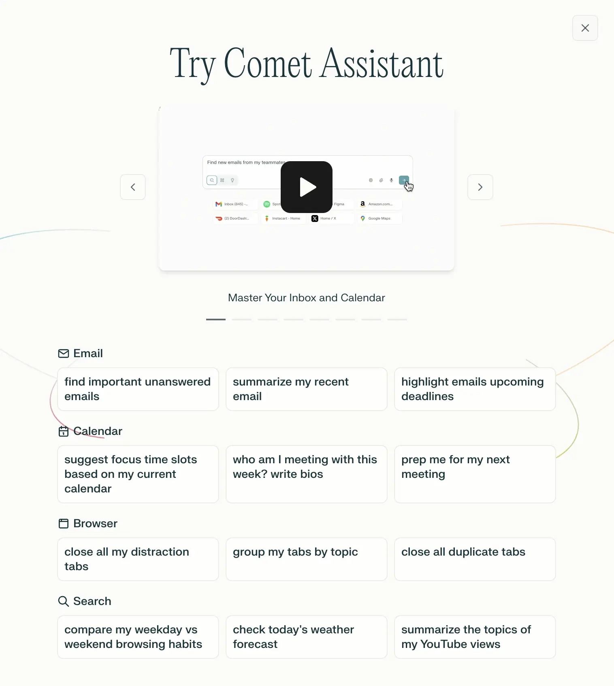
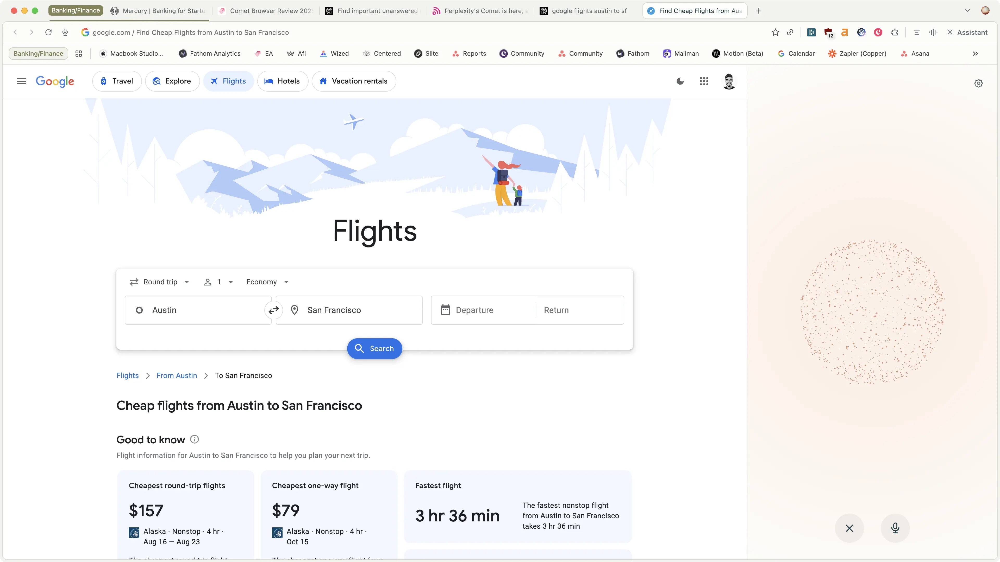

# Comet浏览器：Perplexity团队打造的AI原生浏览器体验

---

如果你每天都在Chrome标签页、ChatGPT和Perplexity之间来回切换，感觉像在做无意义的体力活，那Comet浏览器可能就是你一直在等的东西。它不是又一个"加了AI功能"的普通浏览器——它的AI助手能直接在网页上替你点击、操作，像真人助理一样干活。这听起来有点科幻，但它确实做到了。

---

## Comet浏览器是什么?

Comet是Perplexity团队做的一款AI原生浏览器。如果你在用AI搜索，大概率是ChatGPT或者Perplexity。现在Perplexity直接把战场搬到了浏览器——毕竟你所有工作都在浏览器里发生。

它和其他浏览器最大的区别在于核心的Comet助手。这个助手不只是搜索或者回答问题，**它能真的在网页上替你操作**。业内把这叫"Agentic Browsing"(代理式浏览)，说白了就是AI不再只是回答你的问题，而是直接帮你把事情办了。

## 谁适合用Comet浏览器?

如果你是那种在Perplexity还没火之前就开始用的人,你就是目标用户。Comet可能适合这些人:

- **重度用户**,每天在Perplexity、ChatGPT和浏览器之间疯狂切换
- **等着AI真正"帮你干活"的人**,而不只是聊天机器人
- **对Chrome感到厌倦、对Safari感到无聊的人**

基本上就是早期尝鲜者——能接受产品有些粗糙,但想体验别人还没见过的功能。

## Comet浏览器核心功能

### Comet助手

Comet的内置助手是它和其他浏览器最大的区别。它底层用的是Perplexity,所以常规的搜索和研究功能都很扎实。

它能和你打开的标签页互动,让你的搜索更精准——针对你正在看的内容进行深度研究。不过这个功能Dia浏览器也能做到,不算特别突出。

**真正让人眼前一亮的是它展示了"代理式浏览"的实际样子**——不是技术演示,而是普通人能用的功能。

什么意思?它能连接你的日历和邮箱,告诉你重要邮件(有点像Google助手)。但更厉害的是,**它能替你在网页上操作**。

你可以让它做事情,它会真的在页面上点来点去、必要时打开新页面、像真人一样执行任务。👉 [想了解更多AI搜索如何改变工作方式?](https://pplx.ai/ixkwood69619635)

### Comet语音助手

如果你用过ChatGPT的语音模式,想象一下那个体验,但能和你正在看的网页、打开的标签页、以及整个互联网对话。

想找优惠?想知道YouTube视频的要点?想让它帮你订餐厅?侧边栏的助手都能搞定:

虽然很有前景,但目前它还不能完全在页面上执行操作。虽然他们在X上发过一些演示视频,但实际功能还没到那个程度。

不过,能和网页对话的体验比自己读要爽多了。说不定你现在就在和这篇评测聊天呢。这感觉就像未来已经来了。

### 邮件和日历集成

助手(现在是浏览器)怎么能没有邮件和日历功能?如果你想让它帮你订机票,它得知道你什么时候有空吧?

所以它会要求完整读写你的Gmail和Google日历权限,然后你就能问浏览器关于邮件、即将到来的日程等问题。

这功能感觉Chrome早该有了,不过随着Google即将在Chrome中集成Gemini,我们可能很快就能看到类似的东西。

## Comet浏览器价格

团队说会采用类似Perplexity的免费增值模式:

- **免费版**提供核心功能(部分AI能力,可能有使用限制)
- **Pro版**提供高级AI功能(类似Perplexity Pro/Max),扩展更多AI和代理式浏览功能

## 最终评价

**Comet浏览器值得用吗?**现在下结论还太早,但它确实在搅动这个市场,给Browser Company的Dia带来了真正的竞争压力。

这是我们第一次看到能用键盘和语音这样深度探索和浏览网页的方式。感觉像是我们见过的第一个真正的AI浏览器。

话说回来...有传言OpenAI也在做AI浏览器,所以接下来几个月大家关注的焦点可能就是Comet vs OpenAI vs Dia的三国杀。竞争对终端用户(你和我们)来说是好事,所以我们挺兴奋的。不过我可不想站在他们的位置上,听起来压力山大。

---

## 总结

如果你厌倦了在多个工具间切换,想要一个真正能帮你干活的AI浏览器,Comet值得关注。它不是完美的,但它展示了浏览器的未来可能是什么样子——AI不再只是回答问题,而是真的能替你完成任务。👉 [体验下一代AI搜索和浏览方式](https://pplx.ai/ixkwood69619635),看看这种"代理式浏览"能为你的工作流程带来什么改变。
